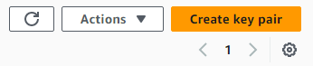
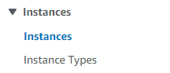
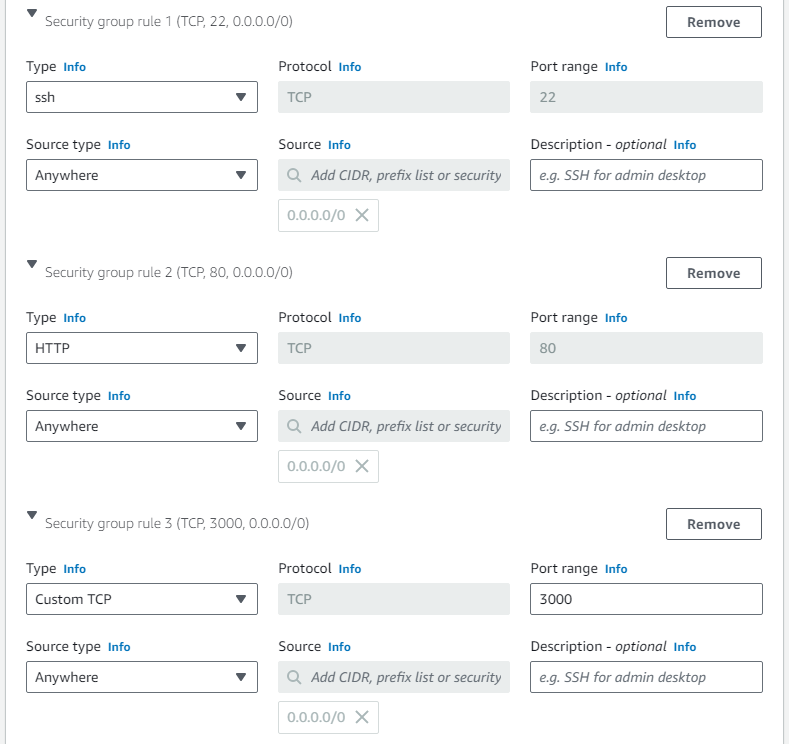
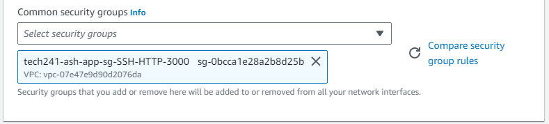

# AWS
## Amazon Web Services

### AWS vs Azure

* Resource Groups
  * Azure: Everything goes in a RG
  * AWS: RGs are not necessery
* Public IP addresses
  * Azure: Static IP address by default
  * AWS: Dynamic IP address by default
* Terminology
  * Azure: VM, Create, Delete, Blob, Container
  * AWS: EC2, Launch, Terminate, S3, Bucket

### Creating an SSH key with AWS:

1. Search for 'Key Pair' at the top, it should be listed as an EC2 feature\
  
2. Click 'Create key pair' in the top right of the screen\
  
3. Setup the key pair by giving them a name and selecting the '.pem' file format\
  
4. Then click 'Create key pair' at the bottom

### Launching an EC2 instance

1. Search for 'EC2' at the top\
   
2. Select 'Instances' from the list on the left\
   
3. Click 'Launch instances' as the top right\
   
4. Name your VM\
   
5. Select an Image for your VM (search 18.04 LTS 1e9)\
   
6. Select the instance type for your VM\
   
7. Select the SSH key pair you'd like to use to access your VM\
   
8. If you haven't launched an instance before, you'll need to setup a Secrurity Group (SG) with the required inbound port rules\
   
   
9. If you already have a SG set up, you can select it instead\
    
10. Click 'Launch instance' at the bottom right\
    

### Public IP vs Private IP

Using a Public IP is like using the front door of a building, you need to go through security checks to get through.
The Private IP is like a doorway between 2 rooms already inside the building, so communication is already trusted.

### User Data

Setup with a provisions file at point of launch

### AMIs

Saves an image of a VM, which you can then make copies of, this is cheaper even than a stopped VM to make copies from.

### S3 Buckets

* AWSCLI
  * aws configure
  * `aws s3 mb s3://<bucketname> --region <region>` creates an s3 bucket
  * `aws s3 cp <filepath> s3://<bucketname>` uploads a file to the bucket
  * `aws s3 sync s3://<bucketname> <dirname>` downloads files from the bucket
  * `aws s3 rm s3://<bucketname>/<filename>` removes a file from the bucket, add `--recursive` instead of `<filename>` to delete all files in the bucket
  * `aws s3 rb s3://<bucketname>` deletes the bucket, the bucket must be empty to do this
* Boto3
  * Boto3 is a Python Package that can be used to achieve the same things listed above using Python scripts

### Auto-Scaling Groups (ASGs)

* Setup a VM with the DB running and add it's Private IP address to the app provisions script
* Run the app with the provisions script as it's user data and wait until it's working
* Create an AMI of the app VM
* Create a launch template with the bash script to run the app
* Create a load balancer
* Setup the ASG to use the AMI and launch template, and the load balancer to handle the incoming traffic

### Virtual Private Clouds (VPCs)

* Setup a VPC
* Setup an Internet Gateway
* Setup the public and private Subnets
* Setup the public Route Table

* Launch an app vm using an ami and launch template script
* Place the vm in the vpc
* will need a new sg in the vpc and to assign a public ip address

* same for the db vm, but the public ip isn't necessery