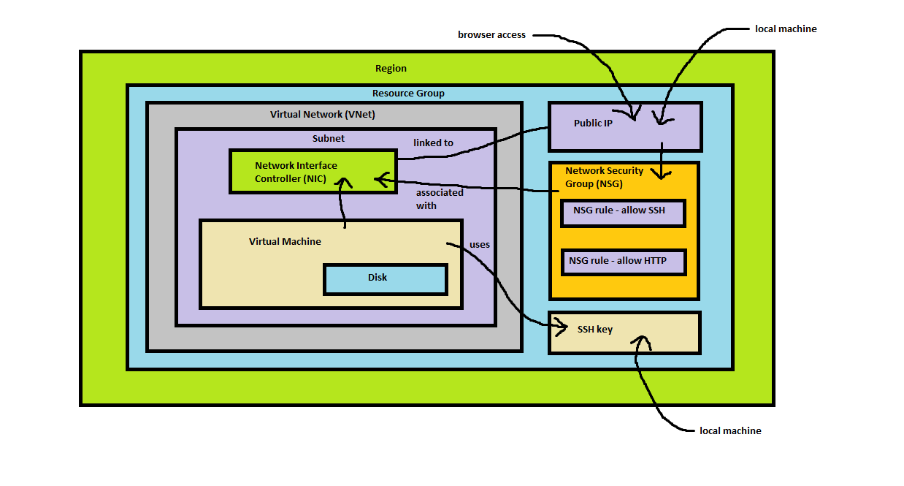

# Azure

### What is a Vitual Machine (VM)

A VM is a computer that can run ran as an on-demand service from the cloud.  
VMs are run through cloud services such as Azure, AWS, etc.  
There is no theoretical limit to how many VMs you run,
as long as you can afford the operational cost of running them.  
When they are set up, VMs are given a kernal image (OS)
and a root directory.

### Setting up an SSH key

This will generate a public and private key:  
* `ssh-keygen -t rsa -b 4096 -C <email>`

The can be used to set the private key to be a read only file:  
* `chmod 400 <key name>`

### Using the Azure Portal

### Azure CLI

* `az login` - takes you to a browser to login to Azure
* `az storage account create --name <storage-account> --resource-group tech241 --location uksouth --sku Standard_LRS` - creates a storage account
* `az storage account list --resource-group tech241` - lists storage accounts in the resource group
* `az storage account list --resource-group tech241 --query "[].{Name:name, Location:location, Kind:kind}" --output table` - lists them in a more readable fashion
* `az storage container create --account-name <storage-account> --name <container>` - creates a storage container in the storage account
* `az storage blob upload --account-name <storage-account> --container-name <container> --name <filename> --file <filepath> --auth-mode login` - uploads a blob (file) to storage
* `az storage blob list --account-name <storage-account> --container-name <container> --output table --auth-mode login` - lists blobs in the container

### Blob Storage

Different ways to access:
* Azure Portal
* Azure CLI (command line interface) <-
* Azure PowerShell

### Types of Redundancy

* LRS (Locally Redundant Storage): Makes 3 copies in 1 location (datacentre) in 1 region
* ZRS (Zone Redundant Storage): Makes 3 copies and stores them at 3 seperate locations (datacentres) in 1 region
* GRS (Geo Redundant Storage): Makes 3 copies in 1 location in 2 seperate regions which are hundreds of miles apart
* GZRS (Geo Zone Redundant Storage): Makes 3 copies in 3 seperate locations in 1 region, then makes 3 copies at 1 location in another region hundrends of miles away
* RA-GRS and RA-GZRS (Read Access GRS and GZRS): Stores copies in the same way as GRS and GZRS respectively, but allows read access in the secondary region if something happens to the primary region access. *Azure doesn't offer this service*