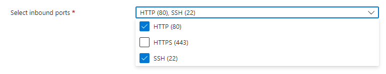

# Setting up the Sparta App on Azure

1. Set up 2 Virtual Machines (VMs) on Azure, one for the App, one for the Database (DB)
   * Running Ubuntu Pro 18.04 LTS - x64 Gen 2
    
   * Allow SSH and HTTP access
    
2. Add the inbound port rules for each VM
   * Allow inbound traffic on port 3000 for the App VM
    
   * Allow inbound traffic on port 27017 for the DB VM
    