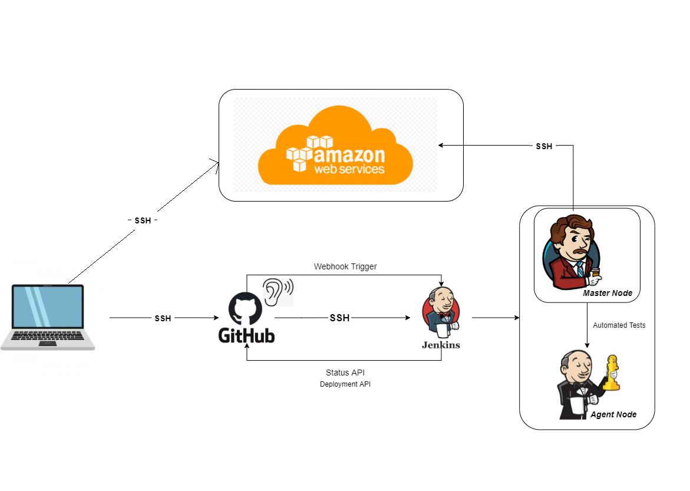
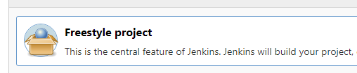
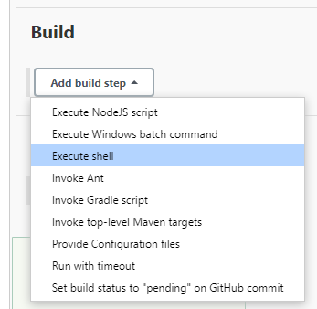
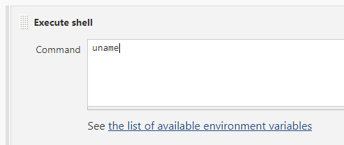
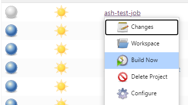
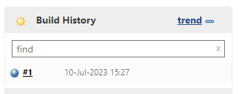
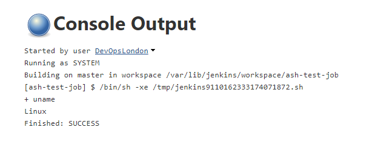

# CICD

Continuous Integration and Continuous Deployment



### Why Jenkins?

Jenkins and all it's dependencies are free which makes it an excellent choice
while we are learning about CICD.

### Why build a pipeline?

To allow us to push new code to a live service in a much faster and more efficient manner than going through all the manual steps ourselves.

### Business Value

Cuts down on time spent redeploying changes and updates,
and significantly reduces the room for human error.

### Using Jenkins

1. Click 'New Item' on the left side of the dashboard\
   
2. Name your job/project and select 'Freestyle Project'
   
3. Scroll down to 'Build' and select 'Execute Shell' from the 'Add build step' menu\
   
4. Add your Linux commands to the command input box, and click save at the bottom\
   
5. Back on the Dashboard, you can select 'Build Now' from your projects drop down menu\
   
6. Once it's built you can click on your project to see the 'Build History'\
   
7. By checking the 'Console Output' within the build, you can see if everything ran correctly\
   

### Linking Github and Jenkins

1. Add an SSH key to the Github repo
2. Make a new job on Jenkins
3. Link the job to the Github repo with the SSH private key
4. Add a Webhook to the Github repo
5. Set the job on Jenkins to trigger the Webhook

### The CICD Pipeline

1. Run tests on dev branch of the app
2. If they pass merge dev branch to main branch and push changes
3. rsync changes to live machine

### Jenkins CD Command Shell Script

```sh
rsync -avz -e "ssh -o StrictHostKeyChecking=no" app ubuntu@ec2-3-252-35-131.eu-west-1.compute.amazonaws.com:/home/ubuntu/repo
ssh -o StrictHostKeyChecking=no ubuntu@ec2-3-252-35-131.eu-west-1.compute.amazonaws.com << EOF
    cd repo/app
    npm install
    pm2 kill
    pm2 start app.js
```