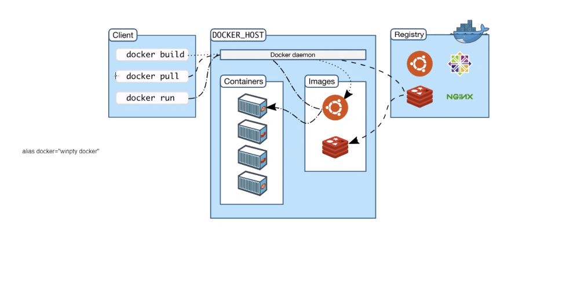

# Docker

### Setting up an nginx image

* `docker run -d -p 80:80 nginx`
* `docker exec -it <imageid> sh`

### Commiting an image to DockerHub

1. `docker commit <imageid> <newimagename>:<tag>`
2. `docker tag <newimagename>:<tag> <username>/<reponame>:<tag>`
3. `docker push <username>/<reponame>:<tag>`

### Running the new image

* `docker run -d -p <portnum>:80 <username>/<reponame>:<tag>`