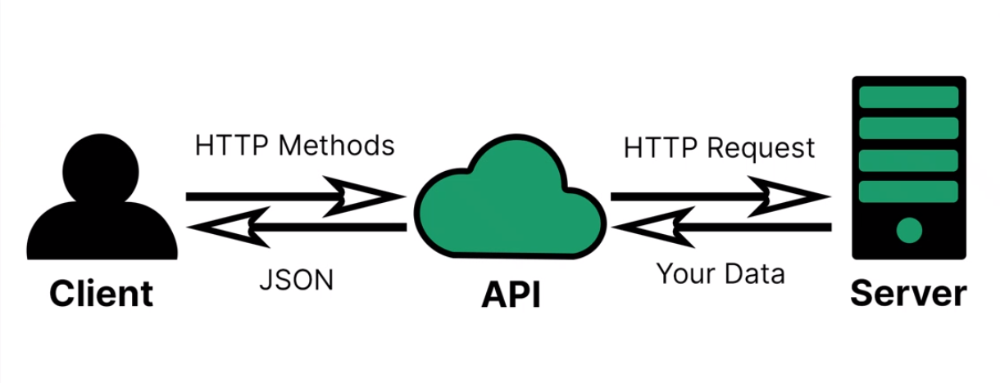

# API Basics

#### What is an API?

An API or application programming interface, is a piece of software
that allows two or more programs to communicate and send data to
each other.  
They are very useful as they allow us to easily send and receive
data in formats that can easily be interpreted by our code.

#### What is a RESTful API?