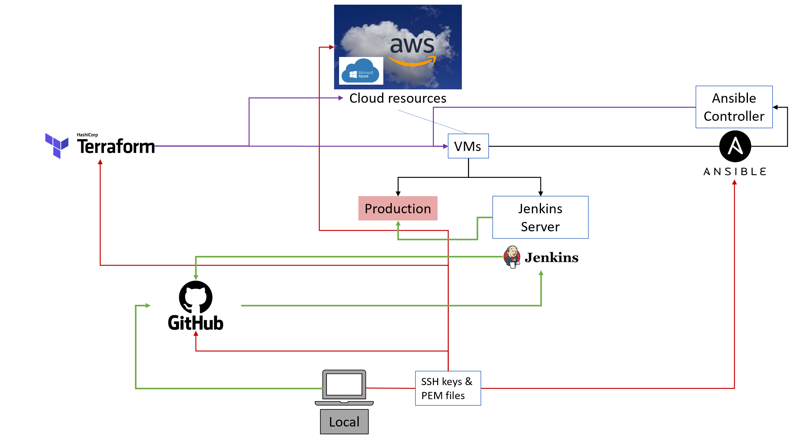

# Terraform


### What is it?
Terraform is an open-source Infrastructure as Code (IaC) tool developed by HashiCorp. It allows users to define and manage infrastructure resources, such as virtual machines, networks, storage, and more, using a declarative configuration language. With Terraform, you can describe your desired infrastructure state in code, and Terraform takes care of provisioning and managing the resources to match that state.

### Why use it and the benefits
* Infrastructure as Code (IaC): Terraform's core benefit lies in its ability to treat infrastructure as code. Infrastructure is defined using human-readable configuration files, which makes it versionable, maintainable, and allows for collaboration across teams. This approach brings consistency and repeatability to infrastructure provisioning and management.

* Multi-Cloud and Multi-Provider Support: Terraform supports various cloud providers (e.g., AWS, Azure, Google Cloud Platform) and on-premises infrastructure. This flexibility allows users to manage resources across multiple cloud providers and maintain a consistent deployment workflow, regardless of the underlying infrastructure.

* Declarative Configuration: Terraform uses a declarative approach, meaning you define the desired state of your infrastructure rather than writing procedural scripts. This makes it easier to understand, manage, and modify infrastructure configurations.

* Dependency Management and Resource Graph: Terraform automatically handles resource dependencies and creates a dependency graph. It ensures resources are provisioned in the correct order, reducing the risk of errors and ensuring the infrastructure is created efficiently.

* Change Management and Planning: Terraform provides a preview of the changes it will apply before executing them. This allows users to review and validate proposed changes, reducing the likelihood of unexpected disruptions in the infrastructure.

* State Management: Terraform keeps track of the state of the managed infrastructure in a state file. This state file is essential for tracking changes and performing updates or modifications to the infrastructure.

#### How to download terraform on Windows:
1. Download Terraform:
    * Go to the official Terraform website: Terraform Downloads
    * Download the Windows 64-bit version of Terraform (usually a zip archive).
2. Extract the Archive:
    * Once the download is complete, locate the downloaded zip archive.
    * Right-click on the zip file and select "Extract All..." to extract its contents to a folder of your choice. You can use the built-in Windows extraction tool or a third-party file archiver like 7-Zip.
3. Add Terraform to System Path:
    * To use Terraform from any directory on the command prompt, you need to add the folder containing the Terraform executable to your system's PATH environment variable.
    * Here's how you can do it:
        * Open the Start menu and search for "Environment Variables."
        * Select "Edit the system environment variables."
        * Click the "Environment Variables..." button.
        * In the System Variables section, scroll down and find the "Path" variable. Click "Edit."
        * Click "New," and then add the path to the folder where you extracted the Terraform executable. For example: `C:\Users\ashle\terraform_1.5.3_windows_amd64`.
4. Verify Installation:
    * Open a new Command Prompt (or PowerShell) window.
    * Type terraform --version and press Enter.
    * If Terraform is correctly installed and added to the system PATH, it will display the version information.
        ```sh
        $ terraform --version
        Terraform v1.5.3
        on windows_amd64
        ```


### Terraform main.tf file

```sh
# launch an EC2 instance
# which cloud - aws
# terraform downloads required dependencies
# terraform ini


# provider name
provider "aws"{
	# which part of this AWS
	region = "eu-west-1"	
}
# Launch an ec2 in Ireland
resource "aws_instance" "app_instance"{

# which machine/OS version etc. AMI-id
  ami = var.webapp_ami_id

# what type of instance
  instance_type = "t2.micro"

# is the public IP required
  associate_public_ip_address = true

# what would you like to name it tech241-ash-terraform-app
  tags = {
       Name = "tech241-ash-terraform-app"
  }
}
```


### App instance:

Ingres:
* HTTP - TCP - 80 - 0.0.0.0/0
* SSH - TCP - 22 - 0.0.0.0/0
* Custom -TCP - 3000 - 0.0.0.0/0

Egres:
* All traffic 0.0.0.0/0

### DB instance:

Ingres:
* SSH - TCP - 22 - 0.0.0.0/0
* Custom - TCP - 27017 - 0.0.0.0/0

Egres:
* All traffic 0.0.0.0/0

#### VPC script:

```sh
resource "aws_vpc" "tech241-ash-vpc" {
  cidr_block       = "10.0.0.0/16"
  instance_tenancy = "default"

  tags = {
    Name = "tech241-ash-vpc"
  }
}
```